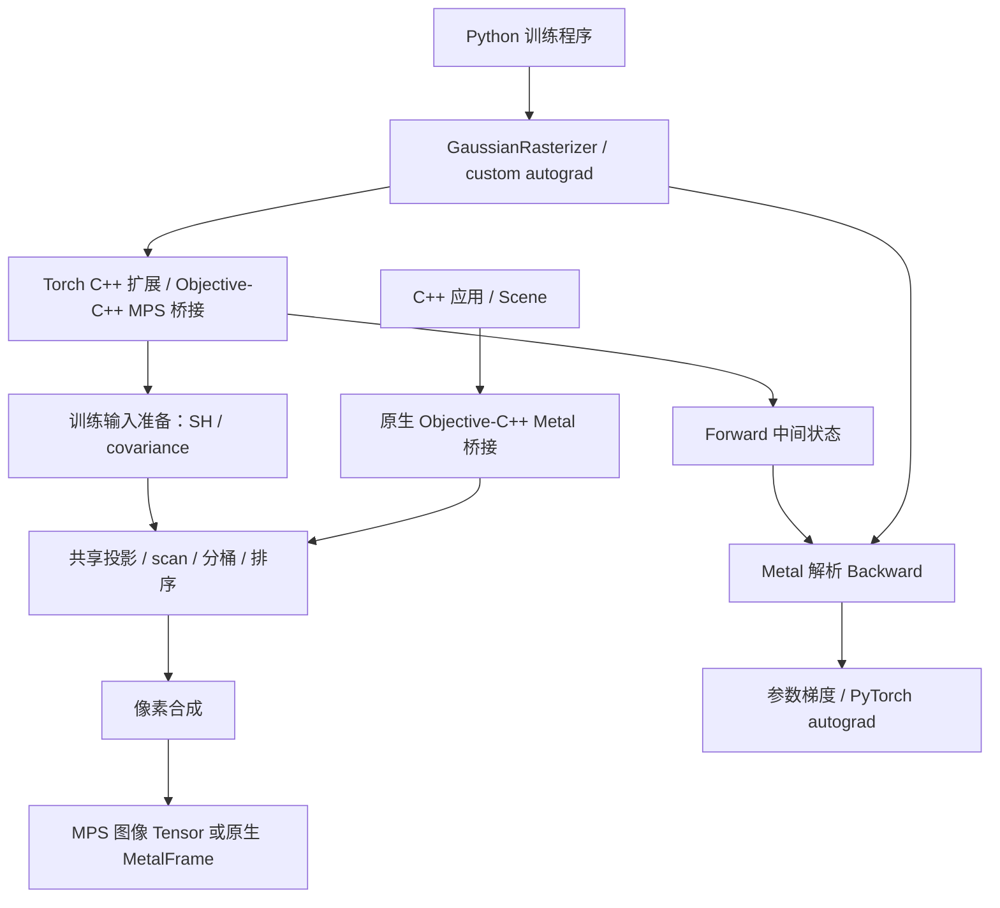

# 架构与数据流

[返回文档导航](README.md)

## 两个调用入口

两条路径复用投影、分层扫描、稳定基数排序及 tile 合成内核，但输出封装不同。原生路径写入 RGBA texture，Torch 路径写入 `[3,H,W]` Tensor。Torch 路径有额外的输入准备、状态保存和梯度计算；它不通过原生 `Scene` 接口转送数据。

## 模块职责

| 模块 | 责任与依赖 |
| --- | --- |
| [include/dgr](../include/dgr/) | 标准 C++ 数据与公共 API，不暴露 Objective-C 或 Torch 头文件 |
| [src/core](../src/core/) | 场景校验、资源限制、独立 Float64 CPU reference |
| [src/metal/metal_rasterizer.mm](../src/metal/metal_rasterizer.mm) | 原生设备、queue、buffer、texture、frame 生命周期 |
| [src/metal/primitives.h](../src/metal/primitives.h) | 两条入口共享的 scan/radix 调度、线程组形状和临时资源池 |
| [bindings/torch](../bindings/torch/) | pybind 入口、MPS storage 访问、同步、训练状态布局 |
| [python/diff_gaussian_rasterization](../python/diff_gaussian_rasterization/) | 原 API、互斥输入检查、autograd 状态和异常快照 |
| [shaders/rasterizer.metal](../shaders/rasterizer.metal) | 投影、分层 scan、duplicate、稳定 radix sort、ranges、tile 合成 |
| [shaders/training.metal](../shaders/training.metal) | SH、三维协方差、Tensor 合成、解析反向、可见性 |
| [examples](../examples/) / [tools](../tools/) | JSON/PLY/相机读取、文件导出、诊断；不属于公共资产 ABI |

原生库使用 C++17；可选 Torch 扩展使用 C++20。CMake 将两份 MSL 源码嵌入生成头文件，运行时在设备上创建 Metal 3.1 library，关闭 fast math。部署编译产物后不需要读取仓库中的 `.metal` 文件。修改 shader 后必须重新构建相应产物。

## Forward 流水线

1. **准备模型。** Torch 的 `training_camera` 打包相机；`training_prepare` 根据互斥模式计算 SH 颜色或读取 RGB，并计算或读取协方差。原生入口直接打包已经准备好的 RGB/covariance。
2. **投影。** `preprocess` 把三维 Gaussian 转为屏幕中心、深度、二维形状和覆盖矩形，记录覆盖的 16×16 像素 tile 数量。一个 Gaussian 可以覆盖多个 tile。
3. **累计数量。** `scan_blocks` 以 256 个元素为一组做包含当前位置的前缀和，递归扫描块总和，再由 `scan_add` 加入前面各块的累计值。非负整数计数以限制值加一饱和，避免溢出。主机读取错误码和实例总数后分配列表。
4. **复制与排序。** `duplicate` 为每个被覆盖的 tile 写入实例；稳定 LSD radix sort 每轮处理 4 位，先排序正深度 Float32 的 32 位，再排序 tile ID 的有效位。局部 SIMD 前缀、跨 SIMD 计数及跨块前缀共同确定 scatter 位置；同键保持 `duplicate` 生成时的 Gaussian ID 顺序。不再补齐到 2 的幂。
5. **建立区间。** `identify_ranges` 保存每个 tile 的候选起止位置，右端不包含在区间内。
6. **合成像素。** `render` 和 `training_render` 调用同一个 `render_tile`。每个 16×16 threadgroup 对应一个 tile，协作加载 256 个候选到 threadgroup memory，再逐像素从近到远混合。越界或提前结束的线程仍参与加载和 barrier，整组完成后统一退出。保存透射率和最后贡献位置的语义保持不变。

“实例数”不是模型点数，也不是实际有贡献的点数。大 Gaussian 覆盖大量 tile 时，即使点数不变，排序和内存开销也会显著增长。精确阈值和特殊分支统一记录在[迁移契约](MIGRATION.md)。

## Backward 和保存状态

Python wrapper 的每次 Forward 都保存独立 Tensor 引用和三个 byte buffer：

| 缓存 | 语义内容 |
| --- | --- |
| geometry | 打包参数、投影结果、SH 负值截断掩码、三维协方差、相机 |
| binning | 排序后的 tile/Gaussian 实例 |
| image | tile 区间、每个像素的最终透射率和最后贡献位置 |

`training_backward_render` 以相同的 16×16 tile 组织，逆序分批共享加载候选，按 Forward 状态反向遍历贡献，累加颜色、不透明度、屏幕位置和二维形状梯度。`training_backward_preprocess` 再将这些梯度传回三维位置、三维协方差、SH、scale 和 rotation。

梯度表示损失对参数微小变化的敏感程度，优化器在调用方使用它更新参数；本库的 Backward 本身不更新模型。多个像素会写入同一个 Gaussian 的梯度，通过 Metal 3 的 device `atomic_float` 加法累加，保持 CUDA/ROCm 每像素原子加法策略。未引入浮点 SIMD 归约；线程调度仍会改变加法顺序，敏感协方差梯度的变化可能超过末位，详见[迁移验证报告](TILE_MIGRATION_REPORT.md)。

这些 byte buffer 是私有状态，不能与 CUDA buffer 互换，也不能作为长期保存的 checkpoint。公开格式和保存建议见[数据格式](DATA_FORMATS.md)。

## MPS 同步与资源生命周期

Torch 绑定直接取得 MPS Tensor 底层的 `MTLBuffer` 和 storage offset。非连续输入会转为连续，不满足 16 字节对齐的切片另行 clone。正常渲染路径不会把整幅图像或模型搬到 CPU；标量检查、显式导出和 debug 快照例外。

绑定在调用方当前 MPS stream 的 serial dispatch queue 内结束旧 encoder，再向该 stream 的 command buffer 编码。Forward 只在读取实例总数/错误码时等待 GPU；后续渲染、Backward 和 markVisible 提交后异步返回。`debug=True` 让 Forward 最后一段和 Backward 等待完成；异步 GPU 错误由 completion handler 记录，下一次后端调用检查。

全局 context 的 mutex 保护编码与 pipeline 缓存，pybind 在 C++ 调用期间释放 GIL。临时 contiguous/clone Tensor 保留到提交完成，之后由当前 MPS stream 的分配器和 command buffer 的资源引用保证在途复用顺序；completion handler 不持有 Python Tensor，避免回调析构等待 GIL 与 GPU 同步形成死锁。每个 MPS stream 独立复用 scan/sort scratch；原生 renderer 也有自己的池。池按本次请求精确尺寸替换、清理未使用槽位；原生预算紧张时淘汰未使用缓存。geometry/binning/image 始终为每次 Forward 独立保存，不进入临时池。

原生 renderer 实例也要求串行使用。`MetalFrame` 可复制并共享资源，renderer 销毁后 frame 仍可读取；借用的 texture handle 依赖 frame 存活。保留很多 frame 或 autograd graph 会同时保留 GPU 内存。

## 当前工程边界

现在采用 CUDA/ROCm 同样的“投影 → 前缀和 → tile 实例 → 稳定深度排序 → tile 协作前向/反向”策略。Metal 的 SIMD 宽度、API、内存布局和数学库仍不同；没有直接链接 CUB/hipCUB，也没有使用 Apple 图形 render pass 的 tile shader。历史取舍见 [tile 迁移前分析](TILE_MIGRATION_ANALYSIS.md)，当前代码、实测收益与数值限制见[迁移报告](TILE_MIGRATION_REPORT.md)。

CPU reference 有两类：独立推导的 Float64 实现，以及抽取原 CUDA 数学体后在 CPU 上执行的 Float32 oracle。后者替换了 GPU 调度和共享内存访问，**不是 NVIDIA GPU 执行**。它们各自能说明什么，见[验证记录](VALIDATION.md)。
