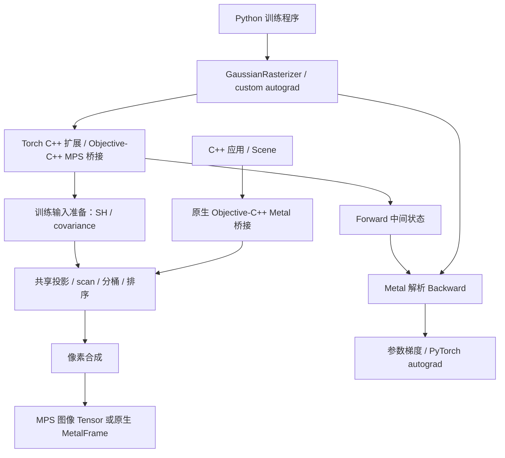

# 架构与数据流

[返回文档导航](README.md)

## 两个调用入口

两条路径复用投影和分桶排序内核，但输出封装不同。原生路径写入 RGBA texture，Torch 路径写入 `[3,H,W]` Tensor。Torch 路径有额外的输入准备、状态保存和梯度计算；它不通过原生 `Scene` 接口转送数据。

## 模块职责

| 模块 | 责任与依赖 |
| --- | --- |
| [include/dgr](../include/dgr/) | 标准 C++ 数据与公共 API，不暴露 Objective-C 或 Torch 头文件 |
| [src/core](../src/core/) | 场景校验、资源限制、独立 Float64 CPU reference |
| [src/metal/metal_rasterizer.mm](../src/metal/metal_rasterizer.mm) | 原生设备、queue、buffer、texture、frame 生命周期 |
| [bindings/torch](../bindings/torch/) | pybind 入口、MPS storage 访问、同步、训练状态布局 |
| [python/diff_gaussian_rasterization](../python/diff_gaussian_rasterization/) | 原 API、互斥输入检查、autograd 状态和异常快照 |
| [shaders/rasterizer.metal](../shaders/rasterizer.metal) | 投影、scan、duplicate、bitonic sort、ranges、原生合成 |
| [shaders/training.metal](../shaders/training.metal) | SH、三维协方差、Tensor 合成、解析反向、可见性 |
| [examples](../examples/) / [tools](../tools/) | JSON/PLY/相机读取、文件导出、诊断；不属于公共资产 ABI |

原生库使用 C++17；可选 Torch 扩展使用 C++20。CMake 将两份 MSL 源码嵌入生成头文件，运行时在设备上创建 Metal library，关闭 fast math。部署编译产物后不需要读取仓库中的 `.metal` 文件。修改 shader 后必须重新构建相应产物。

## Forward 流水线

1. **准备模型。** Torch 的 `training_camera` 打包相机；`training_prepare` 根据互斥模式计算 SH 颜色或读取 RGB，并计算或读取协方差。原生入口直接打包已经准备好的 RGB/covariance。
2. **投影。** `preprocess` 把三维 Gaussian 转为屏幕中心、深度、二维形状和覆盖矩形，记录覆盖的 16×16 像素 tile 数量。一个 Gaussian 可以覆盖多个 tile。
3. **累计数量。** `scan_step` 进行包含当前位置的前缀和，获得每个 Gaussian 的实例写入区间。主机读取错误码和实例总数后分配列表。
4. **复制与排序。** `duplicate` 为每个被覆盖的 tile 写入实例；`bitonic_step` 按 tile、正深度 Float32 位表示、Gaussian ID 排序。ID 决定同深度时的稳定顺序。
5. **建立区间。** `identify_ranges` 保存每个 tile 的候选起止位置，右端不包含在区间内。
6. **合成像素。** `render` 或 `training_render` 从近到远遍历候选，执行相同的 alpha 跳过和透射率停止规则，同时保存最终透射率和最后贡献位置。

“实例数”不是模型点数，也不是实际有贡献的点数。大 Gaussian 覆盖大量 tile 时，即使点数不变，排序和内存开销也会显著增长。精确阈值和特殊分支统一记录在[迁移契约](MIGRATION.md)。

## Backward 和保存状态

Python wrapper 的每次 Forward 都保存独立 Tensor 引用和三个 byte buffer：

| 缓存 | 语义内容 |
| --- | --- |
| geometry | 打包参数、投影结果、SH 负值截断掩码、三维协方差、相机 |
| binning | 排序后的 tile/Gaussian 实例 |
| image | tile 区间、每个像素的最终透射率和最后贡献位置 |

`training_backward_render` 按 Forward 状态反向遍历贡献，累加颜色、不透明度、屏幕位置和二维形状梯度。`training_backward_preprocess` 再将这些梯度传回三维位置、三维协方差、SH、scale 和 rotation。

梯度表示损失对参数微小变化的敏感程度，优化器在调用方使用它更新参数；本库的 Backward 本身不更新模型。多个像素会写入同一个 Gaussian 的梯度，当前通过 uint CAS 实现 Float32 原子累加，因此累加顺序可能影响末位数值。

这些 byte buffer 是私有状态，不能与 CUDA buffer 互换，也不能作为长期保存的 checkpoint。公开格式和保存建议见[数据格式](DATA_FORMATS.md)。

## MPS 同步与资源生命周期

Torch 绑定直接取得 MPS Tensor 底层的 `MTLBuffer` 和 storage offset。非连续输入会转为连续，不满足 16 字节对齐的切片另行 clone。正常渲染路径不会把整幅图像或模型搬到 CPU；标量检查、显式导出和 debug 快照例外。

绑定先等待当前 Torch MPS stream 完成，再在自身 Metal queue 提交工作并等待完成后返回。全局 context 用 mutex 串行保护；这还不是异步 stream 互操作方案。pipeline 在 context 内缓存，但各次调用仍分配新的中间状态。

原生 renderer 实例也要求串行使用。`MetalFrame` 可复制并共享资源，renderer 销毁后 frame 仍可读取；借用的 texture handle 依赖 frame 存活。保留很多 frame 或 autograd graph 会同时保留 GPU 内存。

## 当前工程边界

多 pass scan、补齐到 2 的幂的 bitonic sort、逐像素候选读取、同步等待和重复分配都是当前实现，不是最终性能方案。更换算法必须保持排序、阈值、状态和梯度语义，先通过对照再比较性能。

CPU reference 有两类：独立推导的 Float64 实现，以及抽取原 CUDA 数学体后在 CPU 上执行的 Float32 oracle。后者替换了 GPU 调度和共享内存访问，**不是 NVIDIA GPU 执行**。它们各自能说明什么，见[验证记录](VALIDATION.md)。
