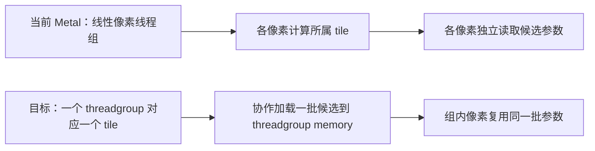

# Metal 与 CUDA / ROCm 的 tile 设计差异及迁移可行性

> 这是迁移前的分析快照，以 `9ac670e` 为基线。以下“当前”均指该基线，所引用的实现与旧架构文档链接固定到该提交，行号也是旧版行号。阶段 1–5 的实现已完成；阶段 0 中的逐 kernel 计时和实际峰值内存仍未完成。迁移后状态及验收结果请看 [TILE_MIGRATION_REPORT.md](TILE_MIGRATION_REPORT.md)。


日期：2026-09-17。Metal 阅读基线为 `9ac670e`，ROCm 为 `6cbb098`；CUDA 对照使用 ROCm 工程保存的固定上游 `59f5f77e3ddbac3ed9db93ec2cfe99ed6c5d121d` 快照，避免把相邻 CUDA 工作目录中的未提交修改当作基准。

## 结论

**Metal 已经使用 16×16 的 tile 分桶。尚未采用的是 CUDA / ROCm 中“一个线程块对应一个 tile，并协作加载共享数据”的像素执行方式。** 另外，Metal 使用全局多轮 scan 和 bitonic sort，CUDA / ROCm 使用 CUB / hipCUB 的设备扫描与基数排序。

可以迁移为与固定 CUDA / ROCm 相同的算法组织，长期架构仍保持 C++ / Objective-C++ / MSL。迁移需要覆盖前向、反向、扫描、排序及两条宿主入口，而不只是调整线程组尺寸。

本次已核对源码、计算现有实现的静态工作量，并在本机运行独立 GPU 能力探针。**渲染内核尚未修改，没有新旧渲染器的性能对比结果。**

## 1. 三种 tile 含义必须分开

| 含义 | 本工程当前情况 | 与本次迁移的关系 |
| --- | --- | --- |
| 软件上的图像分块 | 已按 16×16 像素建立高斯候选列表、排序和 ranges | 已具备 |
| GPU 协作执行分块 | 当前把全部像素展开为一维网格，像素独立访问候选数据 | 需要改成一个 threadgroup 对应一个 tile |
| Apple GPU 的图形 tile shading / imageblock | 当前渲染器采用 compute pipeline，不走这条图形渲染路径 | 不是复刻 CUDA 计算分块所必需的机制 |

Apple 的 tile shaders 与 imageblock 涉及 render pass 内的分块数据和图形处理阶段；CUDA 光栅化器中的 tile 是程序自己管理的计算任务。选择普通 Metal compute 的 threadgroup memory 就能表达后者，无须先改成图形 tile shader。参见 [Apple：tile-based deferred rendering](https://developer.apple.com/documentation/metal/tailor-your-apps-for-apple-gpus-and-tile-based-deferred-rendering)。

## 2. Metal 已有 tile 的源码证据

在 [rasterizer.metal](https://github.com/muzigef/diff-gaussian-rasterization-metal/blob/9ac670ed80649710b0951c5a6fdaf36cd38760e8/shaders/rasterizer.metal) 中：

- `preprocess` 第 70–80 行：按 16 像素计算 tile 网格和每个高斯覆盖的 tile 矩形，保存计数。
- `duplicate` 第 97–108 行：为每个高斯与 tile 的配对写入记录，包含 tile ID、深度和高斯 ID。
- `identify_ranges` 第 129–138 行：保存各 tile 的候选起止位置。
- `render` 第 149–150 行：根据像素所在 tile 读取对应范围。

训练前向与反向同样读取这些 tile 范围，见 [training.metal](https://github.com/muzigef/diff-gaussian-rasterization-metal/blob/9ac670ed80649710b0951c5a6fdaf36cd38760e8/shaders/training.metal) 的 `training_render` 第 501 行和 `training_backward_render` 第 549 行。

当前 Metal 不会让每个像素遍历整个模型；它遍历的是该像素所在 tile 的候选列表。

## 3. 真正不同的是执行组织

| 阶段 | 固定 CUDA | 当前 ROCm | 当前 Metal |
| --- | --- | --- | --- |
| 三维参数准备与投影 | 预处理核函数，按高斯并行 | 基本保留 CUDA 数学体与组织 | 训练准备与投影拆为多个 MSL kernel |
| tile 尺寸 | 16×16 | 16×16 | 16×16 |
| 前缀和 | CUB DeviceScan | hipCUB DeviceScan | 全局 Hillis–Steele，多轮 ping-pong buffer |
| 排序 | CUB 稳定 radix sort | hipCUB 稳定 radix sort | 补齐到 2 的幂的 bitonic sort，显式高斯 ID 破同键平局 |
| 像素工作分配 | 一个 16×16 block 处理一个 tile | 保留相同 block 组织 | 一维像素网格，一个 threadgroup 通常是一段线性像素 |
| 候选数据读取 | 按批次协作加载到 shared memory | 保留 shared memory 批量加载 | 每个像素从 device buffer 独立读取 |
| 前向提前结束 | 像素 done 标记，加整个 block 的完成判断 | 保留相同判断结构 | 每个像素独立 break |
| 反向 | tile 内逆序批量加载，再原子累加 | 保留相同组织与 HIP atomics | 每像素独立逆序读取，uint CAS 模拟 float 累加 |
| 与训练框架衔接 | 原版 CUDA Tensor 与运行时 | 显式传递调用方当前 HIP stream；当前绑定返回前同步 | 等待 Torch MPS stream，再提交自己的 Metal queue，完成后返回 |

CUDA 和 ROCm 的扫描、排序库一次 API 调用内部可能启动多个 kernel，不能把“一次库调用”误写成“一次 GPU dispatch”。

ROCm 对照见固定提交中的 [forward.hip](https://github.com/muzigef/diff-gaussian-rasterization-rocm/blob/6cbb098bb7e1099897cb9f8765e8e81d5adec587/src/hip/forward.hip)、[backward.hip](https://github.com/muzigef/diff-gaussian-rasterization-rocm/blob/6cbb098bb7e1099897cb9f8765e8e81d5adec587/src/hip/backward.hip) 和 [rasterizer_impl.hip](https://github.com/muzigef/diff-gaussian-rasterization-rocm/blob/6cbb098bb7e1099897cb9f8765e8e81d5adec587/src/hip/rasterizer_impl.hip)。

### 3.1 当前 256 个 Metal 线程不等于一个 tile

原生 [metal_rasterizer.mm](https://github.com/muzigef/diff-gaussian-rasterization-metal/blob/9ac670ed80649710b0951c5a6fdaf36cd38760e8/src/metal/metal_rasterizer.mm) 第 127 行和训练 [bridge.mm](https://github.com/muzigef/diff-gaussian-rasterization-metal/blob/9ac670ed80649710b0951c5a6fdaf36cd38760e8/bindings/torch/bridge.mm) 第 90 行，都通过 `dispatchThreads` 分发一维像素索引，线程组形状是最多 256×1×1。

以宽度 980 的图像为例，第一组 256 个线程处理第一行的 x=0–255，共跨越 16 个横向 tile 的第一行。它们并没有负责一个 16×16 的二维区域。

因此，即便线程数量恰好也是 256，其空间组织和数据复用仍与 CUDA 的 16×16 block 不同。



共享加载可减少重复的 device 读取，但不能直接宣称加速 256 倍：当前硬件缓存也会复用部分读取，新的方案还引入 barrier、共享内存和资源占用。净收益需要实测。

## 4. 为什么当前实现没有完成这些优化

[MIGRATION.md](https://github.com/muzigef/diff-gaussian-rasterization-metal/blob/9ac670ed80649710b0951c5a6fdaf36cd38760e8/docs/MIGRATION.md) 第 101–105 行已经明确列出后续工作：分块 scan、radix sort、threadgroup memory 批量加载、减少反向竞争、资源池与异步调度。[ARCHITECTURE.md](https://github.com/muzigef/diff-gaussian-rasterization-metal/blob/9ac670ed80649710b0951c5a6fdaf36cd38760e8/docs/ARCHITECTURE.md) 也明确说明当前逐像素读取和多轮排序不是最终性能方案。

这些是源码与已有文档能直接确认的事实。从实现取舍推断，初版优先建立可检查的功能基线：独立像素循环便于核对合成与反向公式；bitonic 排序容易实现明确的同键顺序；统一的一维编码器可以复用到多数 kernel。完整的早期决策过程没有单独记录，因此不能把所有设计动机当作已证实事实。

代价是没有完成原版协作执行结构和成熟扫描、排序实现的迁移。不能将此归因于 Metal 不支持线程组共享内存，也不能把切换到 C++ 语言本身当作已经解决了这部分性能问题。

## 5. 扫描和排序的实际规模

使用此前保存的 **Metal** 实测实例数，按当前宿主循环计算静态工作量；详见 [static-costs.json](analysis/tile-2026-09-17/static-costs.json)。模型均为 559,263 个高斯。

| 项目 | 980×545 | 1959×1090 |
| --- | ---: | ---: |
| 高斯与 tile 配对记录数 | 2,949,986 | 8,242,730 |
| 补齐后的记录数 | 4,194,304 | 8,388,608 |
| 全局 scan 轮数 | 20 | 20 |
| bitonic 全列表轮数 | 253 | 276 |
| 当前单个排序记录 buffer | 64 MiB | 128 MiB |
| 按源码计算的排序记录逻辑读取量 | 15.8125 GiB | 34.5 GiB |

全分辨率使用的是 Metal 保存的 8,242,730 条记录；同期 ROCm 为 8,242,731，不能混用两端计数。这一差异不改变二者在当前 Metal 算法下需要补齐到 8,388,608 的静态估算。

若补齐后的记录数为 $2^q$，当前 bitonic 两层循环启动的轮数为：

$$
N_{\mathrm{passes}}=\frac{q(q+1)}{2}
$$

读作“轮数等于 q 乘以 q 加一，再除以二”。$q$ 是把 1 连续翻倍到补齐记录数所需的次数；分子为 $q(q+1)$，分母为 2。外层依次设置规模 2、4、8 等，内层执行 1、2、3 等轮，合计得到该公式。源码对应 `bridge.mm` 第 265–268 行和原生桥接中的同类循环。对于 $q=22$，得到 253 轮。

每轮有一半线程负责比较一对 `uint4` 记录，因此逻辑上读取整个记录数组一次，还可能写回交换结果。上表只统计源码层面的记录读取量；**不是实测 DRAM 流量，不包含交换写入，也不是耗时预测**。

从算法工作量看，当前 scan 为 $O(P\log P)$，bitonic 为 $O(M\log^2 M)$。这里 $P$ 是高斯数，$M$ 是补齐后的实例数；大 O 只描述输入规模增长时工作量如何增长，不给出实际毫秒数。分层 scan 可以做到线性总工作量；固定宽度键的 radix sort 则按有限轮数扫描数据。

因此 scan/sort 是明确的优化候选。尚未进行新的分阶段 GPU 计时，不能断言它们一定比像素混合或反向原子竞争耗时更多。

## 6. 这台 Mac 是否具备迁移基础

2026-09-17 在当前 Apple M3 Pro 上运行了独立 compute 探针，结果见 [device-probe.json](analysis/tile-2026-09-17/device-probe.json)：

| 实测项目 | 结果 |
| --- | --- |
| 系统 | macOS 15.6.1 |
| 设备 threadgroup memory 上限 | 32,768 字节，即 32 KiB |
| 探针 pipeline 最大线程数 | 1,024 |
| 探针 pipeline SIMD 宽度 | 32 |
| 实际 dispatch | 4 个线程组，每组 16×16，共 256 个线程 |
| 每组实际使用的动态共享内存 | 10,240 字节，即 10 KiB |
| 协作加载、barrier、跨线程读取校验 | 1,024 个数值全部正确 |

按 CUDA 原版的缓存数组估算，256 个候选的 ID、二维中心和 conic/opacity 合计约 7 KiB；加上 RGB 三通道缓存约 10 KiB。额外的组内完成统计也需要少量空间。

探针证明本机具备对应的线程组、共享内存和同步基础能力；它不包含完整光栅化的寄存器压力、控制分支或梯度竞争。最终内核仍须查询自身 pipeline 的最大线程数和资源用量，不能沿用探针的 1,024 上限当作保证。参见 Apple 的 [pipeline 线程数上限](https://developer.apple.com/documentation/metal/mtlcomputepipelinestate/maxtotalthreadsperthreadgroup) 与 [threadgroup memory 上限](https://developer.apple.com/documentation/metal/mtldevice/maxthreadgroupmemorylength)。

探针源码为 [probe.mm](analysis/tile-2026-09-17/probe.mm)，复现方法：

```sh
mkdir -p output/tile-analysis-20260917
xcrun clang++ -std=c++17 -fobjc-arc -framework Foundation -framework Metal \
  docs/analysis/tile-2026-09-17/probe.mm -o output/tile-analysis-20260917/probe
output/tile-analysis-20260917/probe output/tile-analysis-20260917/device-probe.json
```

## 7. 推荐迁移方案

### 阶段 0：冻结语义，建立分阶段计时

保存同一输入下的当前前向、dense/sparse backward、投影状态、排序 ID、ranges、透射率和最后贡献位置。计时分别覆盖预处理、scan、sort、render、backward、同步与分配；预热后重复测量，并同时记录端到端耗时和 GPU 时间。

基线必须覆盖原生 C++ 与 Torch 两条入口。当前共享 shader 会编入两种独立构建产物，不能只更新其中一种。

### 阶段 1：前向按 tile 协作执行

在原生桥接与 Torch 桥接中新增专用的 tile dispatch：网格为 tile 数量，每组固定为 16×16；使用 `dispatchThreadgroups` 明确产生完整线程组。不能只把当前 `threadsPerThreadgroup` 改为 16×16，而保持 kernel 的一维索引逻辑不变。

新 kernel 使用线程组坐标确定 tile，用组内坐标确定像素。每组按批次加载最多 256 个候选的参数，barrier 后，各有效像素按原顺序混合，最后保存原来的图像、透射率和贡献位置。

**边界线程与提前完成的线程仍要参与必要的合作加载和 barrier。** 当前代码的越界 `return` 与像素自己的 `break`，不能原样搬进包含线程组 barrier 的循环。应转换成 `inside/done` 状态，仅禁止该线程的像素运算；整个线程组统一决定何时退出。Apple 对线程组同步与 SIMD 宽度的说明见 [Porting your Metal code to Apple silicon](https://developer.apple.com/documentation/apple-silicon/porting-your-metal-code-to-apple-silicon)。

第一阶段保持现有投影、排序、阈值和数据布局，便于隔离纯调度差异。原生 texture 输出与训练 CHW Tensor 输出应共享关键混合逻辑，避免两份实现再次分叉。

### 阶段 2：反向也按 tile 协作执行

将 `training_backward_render` 改为同样的二维线程组，按从后向前的候选批次加载参数，继续使用原有 `finalT`、`lastContributor` 和手写梯度公式。

首版可以保留现有 uint CAS 累加，先验证执行组织。随后单独评估原生浮点原子指令或 SIMD/threadgroup 归约的适用性。当前使用 CAS 不等于所有 Metal 版本和设备都不支持 float atomics；是否切换必须核对目标 MSL、GPU 能力和数值语义。

减少原子操作是另一项优化，可能改变浮点相加顺序、寄存器压力和共享内存用量，不能混入首轮迁移后把所有差异一起归因。

### 阶段 3：分层 scan

使用 block 内扫描、block 总和扫描、回填偏移的结构，替换当前对全数组重复执行 20 轮的算法。保持 inclusive 语义、零计数、饱和溢出检查和最终实例数读取行为。

扫描输入是非负整数，在不溢出的条件下可要求新旧偏移逐元素完全一致。至少覆盖 0、1、255、256、257、513 个输入及跨多个块的规模。

### 阶段 4：稳定 radix sort

用 Metal 实现或验证适用的 Metal 并行基础库，替换全局 bitonic。CUB / hipCUB 的现有 GPU 后端不能直接链接为 Metal kernel。

保留“tile ID 优先、正深度位表示次之、同键保持高斯 ID 顺序”的语义。duplicate 的输入顺序本来按高斯 ID 分段，因此在 tile/depth 键上执行稳定 radix sort 即可保持同键顺序；不必为了 ID 再强行扩成 96 位排序键。

关键难点是稳定 scatter：直方图、跨组前缀和、组内位置必须共同保证确定的写入顺序。不能只用全局原子计数器为同一 bucket 随机分配位置，否则可能改变同深度贡献顺序。

基数排序通常需要输入输出 ping-pong 与临时 workspace。虽然可消除全局 bitonic 的补齐和大量轮数，**总峰值内存不保证一定更小**，应实测记录 buffer 与 scratch 的合计。

### 阶段 5：内存复用与 MPS 调度

在输出和梯度基线稳定后，再优化 transient scratch 复用及与当前 MPS 工作队列的依赖衔接。不能只删除 `waitUntilCompleted`，否则输入准备、GPU 读取和临时 Tensor 释放可能发生竞争。

供 backward 使用的每次 forward 状态必须保留到 autograd 不再需要它；它与可短期复用的 scan/sort 临时空间不是同一种生命周期。并发图、多次 forward 后再 backward 都应纳入检查。

## 8. 迁移不会自动消除已有图像误差

Metal 手写 MSL 与原 CUDA 的数学表达式还存在浮点求值结构差异。例如：

- Metal conic 使用 `yy / det` 等直接除法；CUDA 先计算 `det_inv = 1 / det`，再分别相乘。
- Metal 投影对坐标直接除以 w；CUDA 先计算 w 的倒数再乘到各分量。
- 矩阵、`dot` 与标量表达式的计算顺序，以及 `exp` 等设备数学实现，可能造成不同舍入。

这些表达式在实数数学上对应相同计算，float32 中不保证最后几位相同。若接近 alpha 或 tile 边界，连续的舍入差异可能导致离散分支变化。这些是需要单独对照的候选原因，不能仅凭表达式不同就认定逻辑错误。

现有 [差异审计](DIFFERENCE_ANALYSIS.md) 已发现：原视角 Metal 对源码 CPU 参考的最大图像误差约 0.00261343；用同一份 Metal 深度做独立稳定排序时，排序 ID 和 ranges 正确。因此，改成共享内存加载或更快排序本身不能保证消除这些数值差异。

反向的原子累加顺序也会随执行组织变化。对于已超限的敏感高斯，需要比较多次重复范围、同状态 CPU 反向和原始 GPU 基线，不能扩大阈值后把结果标成通过。

## 9. 验收条件

| 类别 | 要求 |
| --- | --- |
| 相同投影数据下的分桶 | counts、offsets、排序 ID、ranges 完全一致 |
| 前向协作加载 | 对照旧 Metal 的 float32 图像、finalT、最后贡献位置；出现差异逐项定位 |
| 反向 | RGB/SH 与 covariance/scale-rotation 四种组合，dense/sparse 梯度与有限差分适用区间 |
| 边界 | 非 16 倍数尺寸、空 tile、零点数、全部裁剪、单 tile 超过一批候选、不同像素提前结束 |
| 同键稳定性 | 同深度、重复键、批次边界、随机与真实场景 |
| 两条入口 | 原生 C++ CMake/CTest 与重编译后的 Torch pytest 都通过 |
| 已有数值差异 | 分开记录已知超限与新引入差异，保持原容差 |
| 性能 | 相同输入、预热、重复测量；分阶段及端到端耗时、实例数、峰值内存均记录 |

尚无 NVIDIA 同输入 GPU 基准，不能把 CPU 参考或 ROCm 结果当作已完成 NVIDIA 实测。迁移目标可以是相同算法与并行结构，逐位相同和相同性能则需要额外证据。

**推荐采用这条迁移路线。** 当前硬件能力和既有 tile 数据结构已经具备基础；主要工程工作是协作前向/反向、分层 scan、稳定 radix sort 和资源调度。先保持语义与私有状态，再分别优化，能让每次变化都具备可解释的验证结果。
